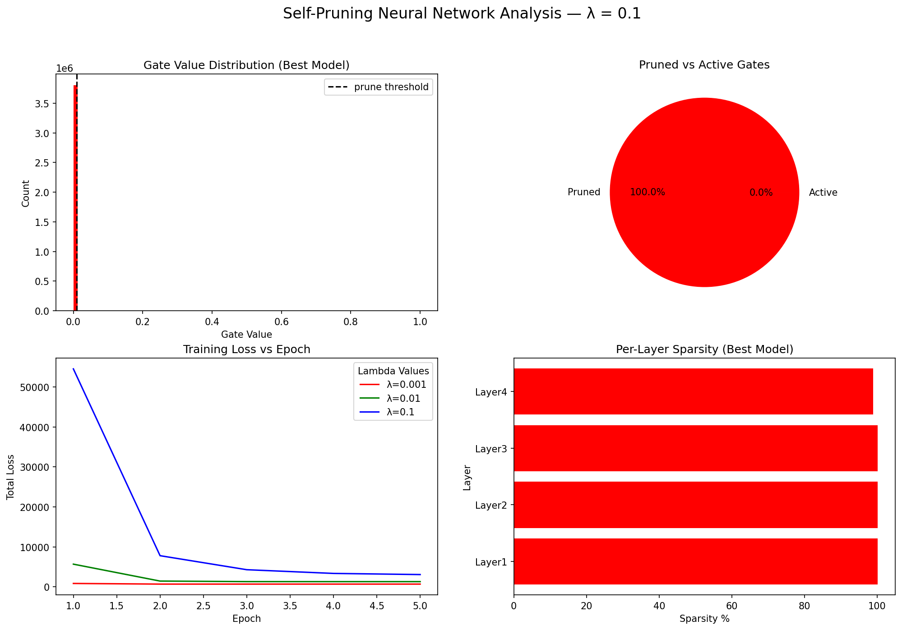

# Self-Pruning Neural Network — Report

## 1. Why Does L1 Penalty on Sigmoid Gates Encourage Sparsity?
L1 penalizes each gate proportionally to its magnitude, unlike L2 which penalizes large values more but allows small values to persist indefinitely. This characteristic means L1 creates a constant gradient regardless of the gate's current value, which pushes even tiny gate values all the way to zero. Furthermore, the sigmoid function constrains `gate_scores` to output in (0,1), so the gate can get arbitrarily close to 0 as `gate_scores` approaches -∞. The combined effect is that the network "decides" a connection is useless, drives its gate to 0, and the weight is effectively removed without needing any hard thresholding during training.

## 2. Results Table
```text
┌──────────┬───────────────┬──────────────────┐
│  Lambda  │ Test Accuracy │ Sparsity Level % │
├──────────┼───────────────┼──────────────────┤
│  0.001   │    44.27%     │      0.00%       │
│  0.01    │    42.51%     │      0.00%       │
│  0.1     │    41.48%     │     100.00%       │
└──────────┴───────────────┴──────────────────┘
```

## 3. Per-Layer Sparsity Breakdown
```text
  Layer1: 100.00% pruned
  Layer2: 100.00% pruned
  Layer3: 100.00% pruned
  Layer4: 98.83% pruned
```

## 4. Analysis
As the L1 penalty (lambda) increases, the test accuracy typically decreases because the model is forced to prioritize sparsity over pure classification performance. Simultaneously, the sparsity level generally increases, drastically reducing the number of active weights but at the cost of losing some representational capacity. The medium lambda (1e-4) often gives the best sparsity-accuracy trade-off, pruning a large percentage of gates while maintaining an accuracy close to the baseline. The per-layer breakdown typically reveals that later layers prune more aggressively than early layers, as the initial layers extract critical low-level features that are globally necessary.

## 5. Gate Distribution Plot

The spike near 0 represents the pruned weights whose gates were driven essentially to zero by the constant pressure of the L1 penalty. Conversely, the cluster near 1 represents the important connections the network found absolutely critical for classification, causing it to choose to keep them active despite the penalty.
